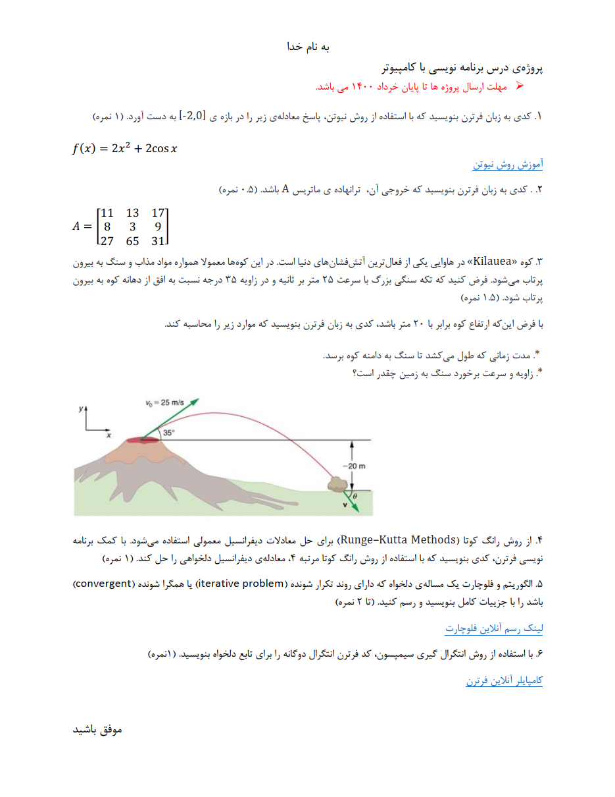

# :computer: Fortran Project | پروژه فرترن
**A university project with several questions and answers in Fortran and Python**

**یک پروژه دانشگاهی با چندین سوال و جواب با زبان Fortran و پایتون**
 
# 💬 **نکات پروژه**

* برای اجرا برنامه، به پایتون بالاتر از نسخه 3.6 نیاز دارید.
* برای اجرا برنامه، به یک کامپایلر Fortran نیاز دارید. همچنین میتوانید از extension های نرم افزارهای JetBrains استفاده کنید.
* جواب هر بخش در دایرکتوری آن است.
* برای دسترسی به همه‌ی پروژه‌های دانشگاهی من، به این لینک مراجعه کنید:

👈🏻 **[پروژه‌های دانشگاهی من](https://github.com/bestmahdi2/Uni__Bachelors_SKU_Path)**

# 📝 **توضیحات پروژه**

